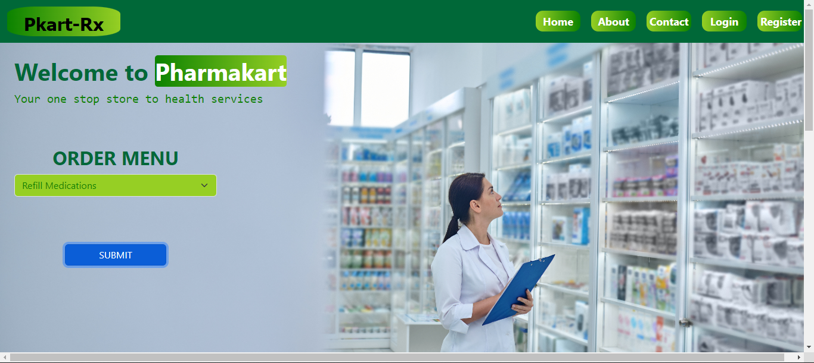

# PharmaKart project
|Pharmakart is an e-commerce healthcare which gives the users the prerogatives to have a one-on-one chat with a doctor, have a pharmacist to review their medications and as well with an option of way-bill services.
# DEVELOPMENT TOOLS

1. FLASK
2. SqlAlchemy
3. MySQL
4. Bootstrap

Intall flask in a virtual environment to enable of it's dependencies to be within the app only and avoid clashes with other apps.

        sudo apt-get update
        python3 -m venv .venv 
        pip install flask

# Install Dependencies
        blinker==1.6.2
        click==8.1.7
        dnspython==2.4.2
        email-validator==2.0.0.post2
        flask==2.3.3
        flask-sqlalchemy==3.0.5
        Flask-WTF==1.1.1
        greenlet==2.0.2
        idna==3.4
        importlib-metadata==6.8.0
        itsdangerous==2.1.2
        Jinja2==3.1.2
        MarkupSafe==2.1.3
        SQLAlchemy==2.0.20
        typing-extensions==4.7.1
        werkzeug==2.3.7
        WTForms==3.0.1
        zipp==3.16.2

# Run pharmakart app with the following on the command line:

#   STEP-1
        FLASK_APP=pharmakart.py
        FLASK_DEBUG=1
        flask run

OR

#   STEP-2
        python3 pharmakart.py

# Perform all operations on the app

interact with Pharmakart health APP

##	 Authors
    Blessed Akhigbe <@pharmakarios1>
    Gamaliel Adun
    George Ifesinachi
